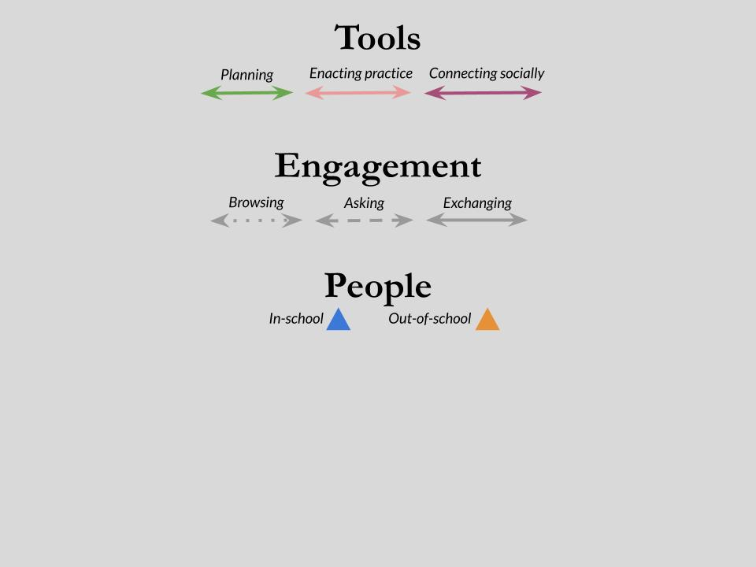
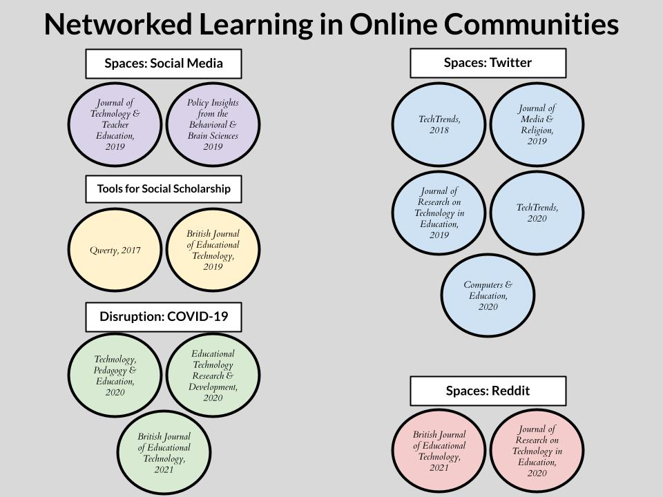
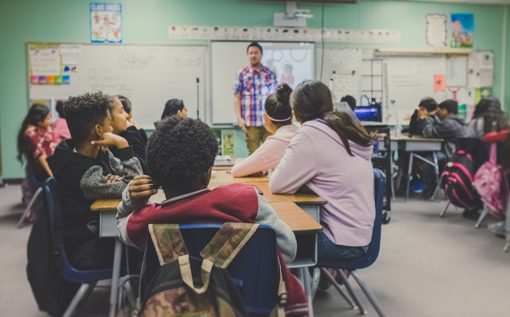

```{r setup, include=FALSE}
usethis::use_git_ignore(c("*.csv", "*.rds"))
options(htmltools.dir.version = FALSE)

library(knitr)
library(tidyverse)
library(xaringan)
library(fontawesome)
```

class: inverse, center, middle

**A DISSERTATION**

Submitted to  
Michigan State University  
in partial fulfillment of the requirements  
for the degree of

**Educational Psychology and Educational Technology**  
Doctor of Philosophy

---

class: inverse, center, middle

**View the slides:** [bretsw.github.io/dissertation-slides](https://bretsw.github.io/dissertation-slides)

**Read the text:** [bretsw.github.io/dissertation-text](https://bretsw.github.io/dissertation-text)

---

class: inverse, center, middle

# Disruptions

---

# COVID-19 Response

```{r, out.width = "720px", echo = FALSE, fig.align = "center"}

```

--

Take a moment to think back on the disruptions of the past year:

--

- How did you respond? 

--

- What help did you need to move forward?

---

# Gaps

```{r, out.width = "600px", echo = FALSE, fig.align = "center"}
include_graphics("img/puzzle-gap.jpg")
```

--

There were gaps in this response for all of us.

--

Formal, official help wasn't enough.

--

It was likely up to you to figure out how to fill the gaps.

---

# Build-Your-Own Support System

--

```{r, out.width = "720px", echo = FALSE, fig.align = "center"}
include_graphics("img/byo-model1.jpg")
```

---

# Build-Your-Own Support System

```{r, out.width = "720px", echo = FALSE, fig.align = "center"}
include_graphics("img/byo-model2.jpg")
```

---

# Build-Your-Own Support System

```{r, out.width = "720px", echo = FALSE, fig.align = "center"}

```

---

# Build-Your-Own Support System

```{r, out.width = "720px", echo = FALSE, fig.align = "center"}
include_graphics("img/byo-model4.jpg")
```

---

# Build-Your-Own Support System

```{r, out.width = "720px", echo = FALSE, fig.align = "center"}
include_graphics("img/byo-model-me0.jpg")
```

---

# Build-Your-Own Support System

```{r, out.width = "720px", echo = FALSE, fig.align = "center"}
include_graphics("img/byo-model-me1.jpg")
```

---

# Build-Your-Own Support System

```{r, out.width = "720px", echo = FALSE, fig.align = "center"}

```

---

# Tensions

```{r, out.width = "600px", echo = FALSE, fig.align = "center"}
include_graphics("img/tension.jpg")
```

--

An extra layer to this:

--

Additional possibilities raise additional tensions

---

# Hidden Complexity

```{r, out.width = "720px", echo = FALSE, fig.align = "center"}
include_graphics("img/edu-verse-model2.jpg")
```

---

# Build-Your-Own Support System

```{r, out.width = "720px", echo = FALSE, fig.align = "center"}
include_graphics("img/byo-model4.jpg")
```

---

# Ties to My Past Research

```{r, out.width = "680px", echo = FALSE, fig.align = "center"}

```

<div class="caption">
<p>View full citations at <a href="http://bretsw.com/cv" target="_blank">bretsw.com/cv</a></p>
</div>

---

# Purpose of This Dissertation

```{r, out.width = "600px", echo = FALSE, fig.align = "center"}

```

--

Explore **build-your-own support systems** 

--

that new teachers construct 

--

during **induction** - the disrupted transition period from preparation to practice

---

# Purpose of This Dissertation

```{r, out.width = "600px", echo = FALSE, fig.align = "center"}

```

Understand how and why new teachers

--

use social media to fill **gaps** during induction

--

and what new **tensions** are created

---

class: inverse, center, middle

# Framework

---

# Professional Learning Networks

```{r, out.width = "560x", echo = FALSE, fig.align = "center"}
include_graphics("img/network.jpg")
```

--

PLNs are a particular type of **support system**:

--

Meant to improve teaching and learning

<p style="font-size:67%">(Krutka et al., 2017; Trust et al., 2016; Trust & Prestridge, 2021)</p>

<div class="caption">
<p>View full citations at <a href="https://bretsw.github.io/dissertation-text/references.html" target="_blank">bretsw.com/dissertation-text/references</a></p>
</div>

---

# Professional Learning Networks

```{r, out.width = "560px", echo = FALSE, fig.align = "center"}
include_graphics("img/network.jpg")
```

- **Tools:** knowledge, skills, teaching resources, curricular materials, and encouragement

--

- **People:** both individuals and groups

--

- **Spaces:** school of employment, district workshops, social media platforms

---

# Perspectives on PLNs

```{r, out.width = "480px", echo = FALSE, fig.align = "center"}
include_graphics("img/streetlamp.jpg")
```

--

**Ecology:** Interconnected, mutually influential spaces 

--

- Helps us to understand **gaps** in the system

--

- Answers: How does it all fit together? What's missing?

--

<span style="font-size:67%">(Barron, 2006; Stevenson et al., 2019; Veletsianos et al., 2019)</span>

<div class="caption">
<p>View full citations at <a href="https://bretsw.github.io/dissertation-text/references.html" target="_blank">bretsw.com/dissertation-text/references</a></p>
</div>
  
---

# Perspectives on PLNs

```{r, out.width = "480px", echo = FALSE, fig.align = "center"}
include_graphics("img/streetlamp.jpg")
```

**Agency:** Intentional, purposeful actions 

--

- Helps us to understand **tensions** in the system

--

- Answers: How does a new teacher construct the system?

--

<span style="font-size:67%">(Bandura, 2001; Wray & Richmond, 2018)</span>

<div class="caption">
<p>View full citations at <a href="https://bretsw.github.io/dissertation-text/references.html" target="_blank">bretsw.com/dissertation-text/references</a></p>
</div>

---

class: inverse, center, middle

# Review of Literature

---

# Induction Literature

```{r, out.width = "480px", echo = FALSE, fig.align = "center"}
include_graphics("img/workshop.jpg")
```

--

- **Tools:** Formal programs <span style="font-size:67%">(Ingersoll & Strong, 2011; Kang & Berliner, 2012; Zhukova, 2018)</span>

--

- **People and Spaces:** Local, offline relationships <span style="font-size:67%">(Cuddapah & Clayton, 2011; Fantilli & McDougall, 2009; Fresko & Alhija, 2015; Kang & Berliner, 2012; Ronfeldt & McQueen, 2017; Stanulis & Floden, 2009; Thompson et al., 2013)</span>

--

**Not taking into account the full scope of possibilities for the support system**

<div class="caption">
<p>View full citations at <a href="https://bretsw.github.io/dissertation-text/references.html" target="_blank">bretsw.com/dissertation-text/references</a></p>
</div>

---

# Social Media Literature

```{r, out.width = "480px", echo = FALSE, fig.align = "center"}

```

--

- **Tools:** Informal learning opportunities <span style="font-size:67%">(Greenhow & Lewin, 2016; Macià & García, 2016)</span>

--

- **People and Spaces:** Global, online connections <span style="font-size:67%">(Beach, 2017; Hur & Brush, 2009; Macià & García, 2016; März & Kelchtermans, 2020; Prestridge, 2017; Trust, 2012; Trust et al., 2016)</span>

--

**Not taking into account the particular needs of new teachers**

<div class="caption">
<p>View full citations at <a href="https://bretsw.github.io/dissertation-text/references.html" target="_blank">bretsw.com/dissertation-text/references</a></p>
</div>

---

class: inverse, center, middle

# Research Questions

---

# Research Questions

```{r, out.width = "420px", echo = FALSE, fig.align = "center"}
include_graphics("img/question.jpg")
```

--

To understand how and why new teachers' build induction support systems:

--

- RQ1. Underlying reasons (**gaps**)

--

- RQ2. Tools

--

- RQ3. People

--

- RQ4. Spaces (social media)

---

class: inverse, center, middle

# Method

---

# Participants

```{r, out.width = "280px", echo = FALSE, fig.align = "center"}
include_graphics("img/teaching.jpg")
```

--

I wanted to understand what new teachers are doing,

--

so I talked to them (semi-structured interviews):

--

- MSU College of Education Master's degree students (*n* = 9)

--

- 0-3 years experience in teaching

--

- Teaching in U.S. (geographically dispersed)

--

- Distinct backgrounds and experiences: classroom teachers, specialists, itinerants, starting mid-year

---

# Participants

```{r, out.width = "680px", echo = FALSE, fig.align = "center"}

```

---

# Data Analysis

--

- Transcribed and coded: 5 rounds (288 codes to 160 in 2nd round... to 11)

--

- Tested inter-rater reliability: 5 rounds

```{r, out.width = "720px", echo = FALSE, fig.align = "center"}
include_graphics("img/irr-comparison-plot.png")
```

--

- Recoded entire dataset: 6th round

---

class: inverse, center, middle

# Results

---

# RQ1. Underlying Reasons (Gaps)

```{r, out.width = "720", echo = FALSE, fig.align = "center"}

```

--

**Change:** new curricula, starting mid-year

--

**Scarcity of resources:** missing classroom materials, poor physical conditions 

--

**Conflicting teaching beliefs:** 

> I have one teacher who just wants to use curriculum from 30 years ago. And I'm just like, ‘I can't do it.’ There are just completely irrelevant things. ~ Hallie

---

# RQ2. Tools

```{r, out.width = "720", echo = FALSE, fig.align = "center"}

```

--

**Planning:**

> There are teachers that are willing to help, but because my team doesn't do a lot of the actual same activity, it doesn't really help to share planning resources, always. ~ Hallie

--

**Enacting practice:** Taylor found YouTube videos to be especially useful for demonstrating activities to her physical education (PE) classes

--

**Connecting socially:** venting frustrations, hearing outside perspectives and diverse opinions

---

# RQ3. People

```{r, out.width = "720", echo = FALSE, fig.align = "center"}
include_graphics("img/RQ3-people.png")
```

--

**In-school:** mentor teachers, professional learning communities (PLCs), teachers' lounge

--

**Out-of-school:** district workshops, district-wide Facebook group, friends and family, professional organizations, social media

---

# RQ4. Social Media: Spaces

```{r, out.width = "480", echo = FALSE, fig.align = "center"}

```

---

# RQ4. Social Media: Possibilities

```{r, out.width = "360", echo = FALSE, fig.align = "center"}
include_graphics("img/social-media-phone.jpg")
```

--

**Planning, in-school:** Google Classroom (LMS) shell

--

**Planning, out-of-school:** TeachersPayTeachers.com, Pinterest

--

**Enacting practice, in-school:** none

--

**Enacting practice, out-of-school:** YouTube

--

**Connecting socially, in-school:** Facebook

--

**Connecting socially, out-of-school:** Facebook, Instagram

---

# RQ4. Social Media: Engagement

```{r, out.width = "720", echo = FALSE, fig.align = "center"}
include_graphics("img/RQ4-engagement.png")
```

--

### "**I feel like I filled a lot of gaps.** If I couldn't find something, I'd go to social media to find it." ~ Julie

---

# RQ4. Social Media: Engagement

```{r, out.width = "720", echo = FALSE, fig.align = "center"}
include_graphics("img/RQ4-engagement.png")
```

**Browsing:** searching for resources on TeachersPayTeachers.com, watching YouTube videos, scrolling through Pinterest

--

**Asking:**

> I wish there was a way to use social media like, ‘Here's a problem I'm dealing with; can people help me with this problem?’ ~ Julie

--

**Exchanging:** interaction and dialogue to satisfy mutual interests, characterized by group membership

---

# RQ4. Social Media: Boundaries

```{r, out.width = "720", echo = FALSE, fig.align = "center"}
include_graphics("img/RQ4-boundaries.png")
```

--

**Personal-professional separation:** separation is more important than potential benefits; having a plan for each platform

--

**Time management:** Simone's goal of not bringing work home

> If I don't have time for myself, then I'm doing [my students] a disservice. I have to have that shut-off button. ~ Mike

--

**Social comparison:**

> Sometimes I feel like, it makes me feel like a crappy teacher, because I'm seeing them do all these things. ~ Anne

---

# Build-Your-Own Support System

```{r, out.width = "720px", echo = FALSE, fig.align = "center"}
include_graphics("img/byo-model4.jpg")
```

---

# Taylor's Support System

```{r, out.width = "720", echo = FALSE, fig.align = "center"}
include_graphics("img/byo-model-taylor.jpg")
```

--

**Gaps:** Lack of undergraduate teacher preparation

**Tensions:** Personal-professional separation

---

# Simone's Support System

```{r, out.width = "720", echo = FALSE, fig.align = "center"}
include_graphics("img/byo-model-simone.jpg")
```

--

**Gaps:** Professional isolation, lack of resources

**Tensions:** Time management

---

# Anne's Support System

```{r, out.width = "720", echo = FALSE, fig.align = "center"}
include_graphics("img/byo-model-anne.jpg")
```

--

**Gaps:** Missing classroom materials, poor physical conditions

**Tensions:** Social comparison

---

class: inverse, center, middle

# Discussion

---

# Uniformity of Results: **Agency**

```{r, out.width = "480", echo = FALSE, fig.align = "center"}
include_graphics("img/tools.jpg")
```

--

- New teachers exercised **agency** in navigating **tensions**

--

- Purposeful sense of having a job to do: build-your-own support system

--

- Determination to find the tools, people, and spaces necessary to do that job well 

--

- But also intentionality to sometime choose *not* to pursue (boundaries)

---

# Variance of Results: **Ecology**

```{r, out.width = "480", echo = FALSE, fig.align = "center"}
include_graphics("img/interconnected.jpg")
```

--

- New teachers experienced induction complications differently - different **gaps** related to distinct contextual realities and challenges

--

- They developed their support systems accordingly

--

- Interconnected and mutually influential pieces (**ecology**)

--

- They then navigated different **tensions**

---

class: inverse, center, middle

# Implications

---

# Implications for New Teachers

```{r, out.width = "480", echo = FALSE, fig.align = "center"}
include_graphics("img/puzzle-gap.jpg")
```

--

### Passion alone is not enough

--

- Build-your-own support systems are necessary

--

- Today there are more available tools, people, and spaces to fill the **gaps**

--

- You are not alone in navigating increased **tensions** like *context collapse* and *social comparison*

---

# Implications for Ed Leaders

```{r, out.width = "480", echo = FALSE, fig.align = "center"}
include_graphics("img/tension.jpg")
```

--

### Agency is finite

--

- Meet new teachers where they are as they try to fill **gaps**:

--

  - Expand notions of what "counts" for professional development to include social media: alleviates some **tensions** around time

--

  - Set up protected spaces for new teachers and train them to use: alleviates some **tensions** around social comparison

---

# Implications for Researchers

```{r, out.width = "400", echo = FALSE, fig.align = "center"}
include_graphics("img/future-research.jpg")
```

--

**Gaps:** Seek a greater diversity of perspectives: 

--

- Try to understand experiences of new teachers with minoritized identities

--

- Or those disrupted by other transitions (e.g., pandemic)

--

**Tensions:** Further investigate boundaries, forms of engagement <span style="font-size:67%">(Bozkurt et al., 2020; Prestridge, 2019)</span>, and how these change over time

--

- Study broad trends through surveys or data mining of social media activity

---

class: inverse, center, middle

# Conclusion

---

# Conclusion

```{r, out.width = "420px", echo = FALSE, fig.align = "center"}
include_graphics("img/edu-verse.jpg")
```

The goal, for all of us:

--

**Sustaining, not just retaining new teachers**

--

- Nurture build-your-own support systems to fill induction **gaps**

--

- Seek further insight into navigating the resulting **tensions**...

--

...as new teachers continue to reflect: *"I feel like I filled a lot of gaps..."*

---

class: inverse, center, middle

# Thank you!

```{r, out.width = "600px", echo = FALSE, fig.align = "center"}
include_graphics("img/xkcd-thesis-defense.png")
```

<div class="caption">
<p><a href="https://m.xkcd.com/1403" target="_blank">XKCD: "Thesis Defense"</a></p>
</div>

<hr>

`r fa("envelope", fill = "white")` [staudtwi@msu.edu](mailto:staudtwi@msu.edu) | `r fa("twitter", fill = "white")` [@bretsw](https://twitter.com/bretsw) | `r fa("globe", fill = "white")` [bretsw.com](http://bretsw.com)