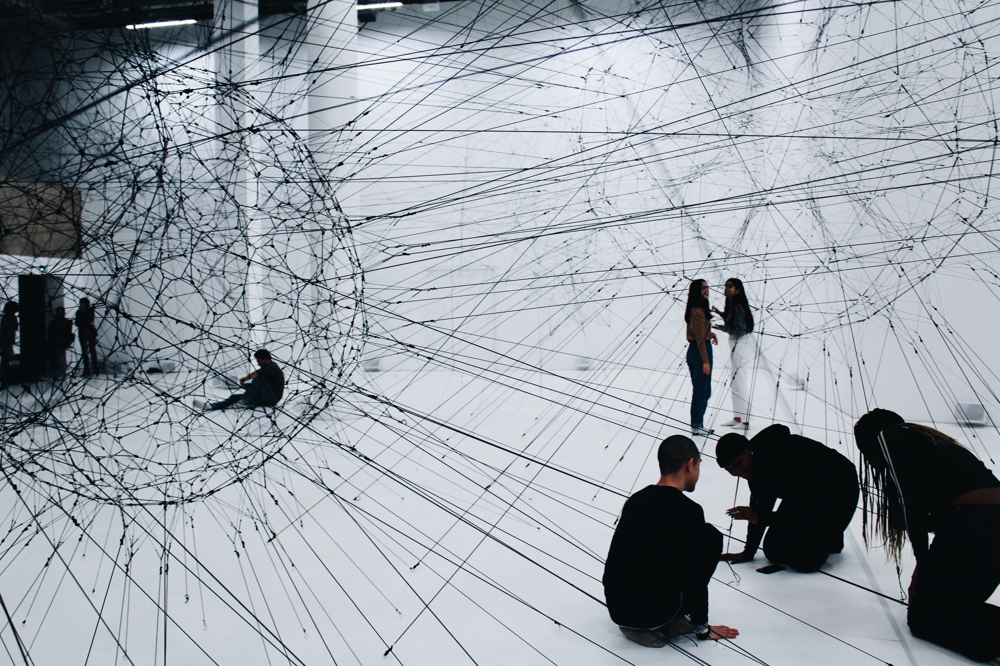
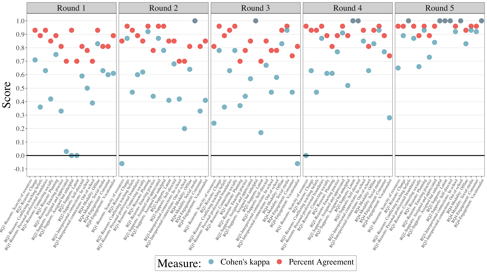

```{r setup, include=FALSE}
usethis::use_git_ignore(c("*.csv", "*.rds"))
options(htmltools.dir.version = FALSE)

library(knitr)
library(tidyverse)
library(xaringan)
library(fontawesome)
```

class: inverse, center, middle

**View Slides:** [bretsw.github.io/dissertation-slides](https://bretsw.github.io/dissertation-slides)

**Connect on Twitter:** [@bretsw](https://twitter.com/bretsw)

---

class: inverse, center, middle

# Teacher Induction

---

# Transition

### From preparation to practice

```{r, out.width = "720px", echo = FALSE, fig.align = "center"}
include_graphics("img/teacher.jpg")
```

---

# Tension

### What and how to teach

```{r, out.width = "720px", echo = FALSE, fig.align = "center"}
include_graphics("img/tension.jpg")
```

---

# Two Worlds

### Conflicting messages about what and how to teach

```{r, out.width = "600px", echo = FALSE, fig.align = "center"}

```

--

1. Teacher preparation program

--

1. School of employment

---

# More Spaces Available

```{r, out.width = "720px", echo = FALSE, fig.align = "center"}

```

---

# Support System

### Conflicting messages about what and how to teach

```{r, out.width = "720px", echo = FALSE, fig.align = "center"}

```

---

# Purpose

```{r, out.width = "600px", echo = FALSE, fig.align = "center"}
include_graphics("img/purpose.jpg")
```

--

Explore the **support systems** new teachers construct during induction

--

and how they use **social media** toward this end

---

class: inverse, center, middle

# Framework

---

# Professional Learning Networks

```{r, out.width = "560x", echo = FALSE, fig.align = "center"}

```

--

### PLNs are a type of support system to improve teaching and learning

---

# Professional Learning Networks

```{r, out.width = "560px", echo = FALSE, fig.align = "center"}

```

- **Tools** - knowledge, skills, teaching resources, curricular materials, and encouragement

--

- **People** - both individuals and groups

--

- **Spaces** - school of employment, district workshops, social media platforms

---

# Perspectives on PLNs

```{r, out.width = "480px", echo = FALSE, fig.align = "center"}
include_graphics("img/streetlamp.jpg")
```

--

- **Ecological perspective:** Interconnected, mutually influential spaces

--

  - How do disparate pieces of a new teacher's PLN fit together?
  
--

- **Agentic perspective:** Intentional, purposeful actions

--

  - How does a new teacher put the pieces of their PLN together?

---

# PLN System: Ecology & Agency

```{r, out.width = "720px", echo = FALSE, fig.align = "center"}

```

---

class: inverse, center, middle

# Review of Literature

---

# Induction Literature

```{r, out.width = "520px", echo = FALSE, fig.align = "center"}
include_graphics("img/workshop.jpg")
```

--

1. **Tools:** Formal programs

--

1. **People:** Local (in-school, in-district) relationships

--

1. **Spaces:** Offline

--

**Not taking into account the full scope of possibilities for the support system**

---

# Social Media Literature

```{r, out.width = "520px", echo = FALSE, fig.align = "center"}
include_graphics("img/social-media.jpg")
```

--

1. **Tools:** Informal learning opportunities

--

1. **People:** Global

--

1. **Spaces:** Online

--

**Not taking into account the particular needs of new teachers**

---

class: inverse, center, middle

# Purpose and Research Questions

---

# Purpose

```{r, out.width = "600px", echo = FALSE, fig.align = "center"}
include_graphics("img/purpose.jpg")
```

--

Explore the **support systems** new teachers construct during induction

--

and how they use **social media** toward this end

---

# Research Questions

```{r, out.width = "480px", echo = FALSE, fig.align = "center"}
include_graphics("img/question.jpg")
```

--

- RQ1. Underlying reasons

--

- RQ2. Tools

--

- RQ3. People

--

- RQ4. Social media (spaces)

---

class: inverse, center, middle

# Method

---

# Participants

```{r, out.width = "280px", echo = FALSE, fig.align = "center"}
include_graphics("img/teaching.jpg")
```

--

I wanted to understand what new teachers are doing,

--

so I talked to them (semi-structured interviews):

--

- MSU College of Education Master's degree students (*n* = 9)

--

- 0-3 years experience in teaching

--

- Teaching in U.S. (geographically dispersed)

--

- Distinct backgrounds and experiences: classroom teachers, specialists, itinerants, starting mid-year

---

# Data Analysis

--

- Transcribed and coded: 5 rounds (288 codes to 160 in 2nd round... to 11)

--

- Tested inter-rater reliability: 5 rounds

```{r, out.width = "720px", echo = FALSE, fig.align = "center"}

```

--

- Recoded: 6th round

---

class: inverse, center, middle

# Results

---

# RQ1. Underlying Reasons

```{r, out.width = "720", echo = FALSE, fig.align = "center"}
include_graphics("img/RQ1-reasons.png")
```

--

**Change:** new curricula, starting mid-year

--

**Scarcity of resources:** missing classroom materials, poor physical conditions 

--

**Conflicting teaching beliefs:** 

> I have one teacher who just wants to use curriculum from 30 years ago. And I'm just like, ‘I can't do it.’ There are just completely irrelevant things. ~ Hallie

---

# RQ2. Tools

```{r, out.width = "720", echo = FALSE, fig.align = "center"}
include_graphics("img/RQ2-tools.png")
```

--

**Planning:**

> There are teachers that are willing to help, but because my team doesn't do a lot of the actual same activity, it doesn't really help to share planning resources, always. ~ Hallie

--

**Enacting practice:** Taylor found YouTube videos to be especially useful for demonstrating activities to her physical education (PE) classes

--

**Connecting socially:** venting frustrations, hearing outside perspectives and diverse opinions

---

# RQ3. People

```{r, out.width = "720", echo = FALSE, fig.align = "center"}

```

--

**In-school:** mentor teachers, professional learning communities (PLCs), teachers' lounge

--

**Out-of-school:** district workshops, district-wide Facebook group, friends and family, professional organizations, social media

---

# RQ4. Social Media: Spaces

```{r, out.width = "480", echo = FALSE, fig.align = "center"}
include_graphics("img/RQ4-platforms.png")
```

---

# RQ4. Social Media: Possibilities

```{r, out.width = "360", echo = FALSE, fig.align = "center"}
include_graphics("img/social-media-phone.jpg")
```

--

**Planning, in-school:** Google Classroom (LMS) shell

--

**Planning, out-of-school:** TeachersPayTeachers.com, Pinterest

--

**Enacting practice, in-school:** none

--

**Enacting practice, out-of-school:** YouTube

--

**Connecting socially, in-school:** Facebook

--

**Connecting socially, out-of-school:** Facebook, Instagram

---

# Simone's Support System (PLN)

```{r, out.width = "720", echo = FALSE, fig.align = "center"}
include_graphics("img/system-simone.jpg")
```

---

# Taylor's Support System (PLN)

```{r, out.width = "720", echo = FALSE, fig.align = "center"}
include_graphics("img/system-taylor.jpg")
```

---

# RQ4. Social Media: Engagement

```{r, out.width = "720", echo = FALSE, fig.align = "center"}

```

--

### "**I feel like I filled a lot of gaps.** If I couldn't find something, I'd go to social media to find it." ~ Julie

--

**Browsing:** searching for resources on TeachersPayTeachers.com, watching YouTube videos, scrolling through Pinterest

--

**Asking:**

> I wish there was a way to use social media like, ‘Here's a problem I'm dealing with; can people help me with this problem?’ ~ Julie

--

**Exchanging:** interaction and dialogue to satisfy mutual interests, characterized by group membership

---

# Build-Your-Own Support System

```{r, out.width = "720", echo = FALSE, fig.align = "center"}
include_graphics("img/system-you.jpg")
```

---

# RQ4. Social Media: Boundaries

```{r, out.width = "720", echo = FALSE, fig.align = "center"}

```

--

**Personal-professional separation:** separation is more important than potential benefits; having a plan for each platform

--

**Time management:** Simone's goal of not bringing work home

> If I don't have time for myself, then I'm doing [my students] a disservice. I have to have that shut-off button. ~ Mike

--

**Social comparison:**

> Sometimes I feel like, it makes me feel like a crappy teacher, because I'm seeing them do all these things. ~ Anne

---

class: inverse, center, middle

# Discussion

---

# Uniformity of Results

```{r, out.width = "480", echo = FALSE, fig.align = "center"}
include_graphics("img/tools.jpg")
```

--

- New teachers decribed having a purposeful sense of having a job to do 

--

- Determination to find the tools, people, and spaces necessary to do that job well

--

- But also intentionality to sometime choose *not* to pursue

--

- That is, new teachers exercised **agency**

---

# Variance of Results

```{r, out.width = "480", echo = FALSE, fig.align = "center"}
include_graphics("img/interconnected.jpg")
```

--

- Teaching is complicated by contextual realities and challenges

--

- New teachers experience these complications differently

--

- They develop their support systems accordingly in a way that makes sense

--

- Interconnected and mutually influential pieces (**ecology**)

---

class: inverse, center, middle

# Implications

---

# Implications for New Teachers

```{r, out.width = "480", echo = FALSE, fig.align = "center"}
include_graphics("img/complicated.jpg")
```

--

- Social media have expanded the number of available tools, people, and spaces 

--

- But, this means increased demands on time and agency

--

- You are not alone in navigating **context collapse** and **social comparison**

---

# Implications for Ed Leaders

```{r, out.width = "480", echo = FALSE, fig.align = "center"}
include_graphics("img/self-directed.jpg")
```

--

Goal should be **sustaining** new teachers, not just **retaining** them:

--

- Expand notions of what “counts” for professional development - include social media

--

- At minimum: Offer a clear, positively-framed social media policy

--

- Better yet: Set up protected spaces for new teachers

---

# Implications for Researchers

```{r, out.width = "560", echo = FALSE, fig.align = "center"}
include_graphics("img/future-research.jpg")
```

--

- Seek a greater diversity of perspectives: Try to understand experiences of new teachers with minoritized identities

--

- Examine changes over time: pandemic disruptions, social movements

--

- Study broad trends: survey, data mining of social media activity

---

class: inverse, center, middle

# Conclusion

---

# Conclusion

```{r, out.width = "480px", echo = FALSE, fig.align = "center"}
include_graphics("img/edu-verse.jpg")
```

### Passion alone is not enough to sustain teaching careers

--

Tension between possibilities (ecology) and agency

--

Tensions reside in new teachers' support systems: **"I feel like I filled a lot of gaps..."**

---

class: inverse, center, middle

# Thank you!

```{r, out.width = "600px", echo = FALSE, fig.align = "center"}
include_graphics("img/xkcd-thesis-defense.png")
```

https://m.xkcd.com/1403

<hr>

`r fa("envelope", fill = "white")` [staudtwi@msu.edu](mailto:staudtwi@msu.edu) | `r fa("twitter", fill = "white")` [@bretsw](https://twitter.com/bretsw) | `r fa("globe", fill = "white")` [bretsw.com](http://bretsw.com)